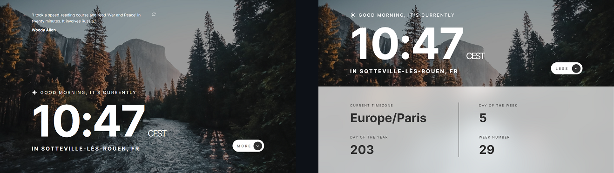
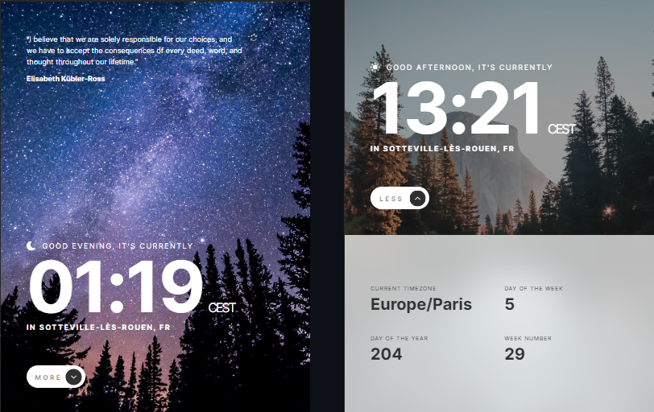
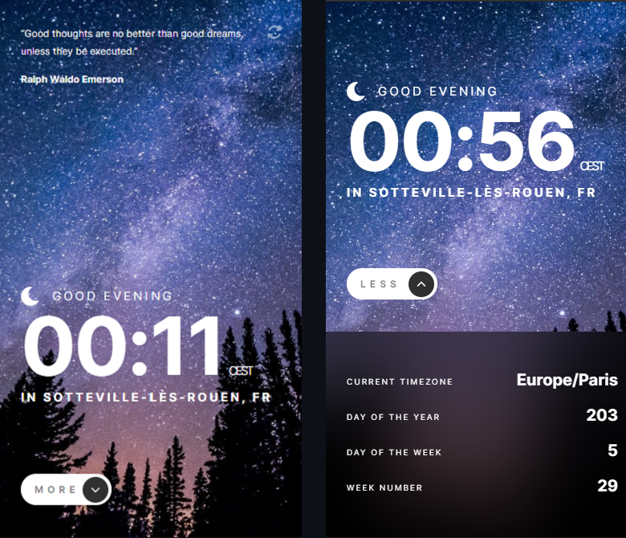

# Frontend Mentor - Clock App solution

Solution to the [Clock App challenge on Frontend Mentor](https://www.frontendmentor.io/challenges/clock-app-LMFaxFwrM). A small clock app using World Time and Geolocation APIs. 

Update : Had to "ditch" the World Time api, I think the thing is down or extra buggy, dunno. Had to revert to pure JS to get the date and calculate datas like timezone, day of the year, etc ...

## Table of contents

- [Overview](#overview)
  - [The challenge](#the-challenge)
  - [Screenshots](#screenshot)
  - [Links](#links)
- [My process](#my-process)
  - [Built with](#built-with)
  - [Useful resources](#useful-resources)
  - [Credits](#credits)

## Overview

### The challenge

Users should be able to:

- View the optimal layout for the site depending on their device's screen size
- See hover states for all interactive elements on the page
- View the current time and location information based on their IP address
- View additional information about the date and time in the expanded state
- Be shown the correct greeting and background image based on the time of day they're visiting the site
- Generate random programming quotes by clicking the refresh icon near the quote

### Screenshots

- Desktop  
  
- Tablet  
  
- Mobile  

### Links

- [Solution URL](https://www.frontendmentor.io/solutions/responsive-clock-app-html5-sass-and-vanilla-js-with-apis-TgsRp316u)  
- [Live Site URL](https://charlottesaidi.github.io/clock-app/) 

## My process

### Built with

- HTMLS
- Sass
- Flexbox
- JavaScript vanilla
- [Figma](https://www.figma.com/) and Font Installer

### Useful resources

- [StackOverflow](https://stackoverflow.com/) - guys on this site provide really useful functions (like maths for the Date object)
- [CSS-Tricks](https://css-tricks.com/) -found a lot of before/after styling tricks
- [MomentJs](https://momentjs.com/) - helped easily get the timezone abbreviation

### Credits  
Many thanks to [Amon](https://www.frontendmentor.io/profile/A-amon), on FrontEnd Mentor, who gave me useful advices and suggestions, js logic and css I hadn't thought about while working on this project on first try.
